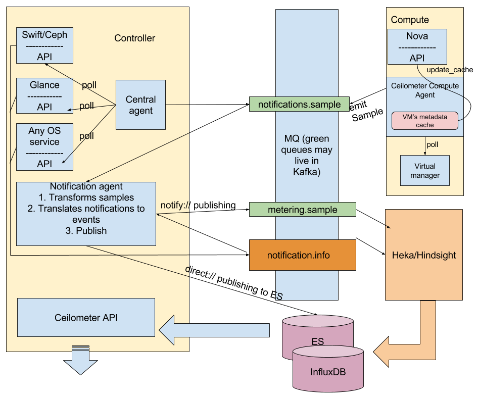

.. _architecture:

Architecture overview
---------------------

The Telemetry plugin uses Ceilometer agents to collect data and its own
processing mechanism to put the data into storages. Ceilometer API is used
to retrieve the data and present it to the end user.
The following diagram shows the OpenStack Telemetry plugin architecture:

Ceilometer agents are deployed as follows:

* The central agents service is placed on controllers. This service polls
  metrics about OpenStack services. A central agent obtains the measurements
  and sends them to the ``notifications.sample`` queue.

  .. note:: If Kafka is not deployed, only one central agent will be running
            in the environment under Pacemaker. If Kafka is deployed, the
            coordination mechanism with Zookeeper will be automatically
            enabled.

* Compute agents work on compute nodes and use the same code base as the
  central agents. The main difference is the configuration and the fact
  that compute agents use metadata cache that is enabled by the Telemetry
  plugin. The compute agents request instance metadata from Nova
  API every 10 minutes, but not each polling interval. For more information,
  see the OpenStack Telemetry service
  `specification <https://github.com/openstack/telemetry-specs/blob/master/specs/mitaka/Improve-instance-metering.rst>`_.
  A compute agent obtains the measurements and sends them to the
  ``notifications.sample`` queue.

* Notification agents are placed on controllers. Each notification agent
  performs the following:

  * Obtains data from polling agents and OpenStack services. In other words,
    it listens to the ``notifications.sample`` and ``notifications.info``
    queues. The Telemetry plugin may be customized at this point. By default,
    Ceilometer notification agents do not convert OpenStack notifications to
    Ceilometer Events. If you enable Event API, notification agents will write
    Events directly to Elasticsearch with the ``direct://`` publisher.
  * Performs transformations and sends the data further to the
    ``metering.sample`` queue.

    .. note::
       In Mirantis OpenStack, Ceilometer notification agents do not require
       coordination. For more details, see
       `Custom transformed metrics <https://docs.mirantis.com/openstack/fuel/fuel-9.0/mos-planning-guide.html#monitoring-custom-transformed-metrics>`_.

A notification agent is the last Ceilometer-related processor. As a result,
all the data collected is placed in the ``metering.sample`` queue and
Ceilometer Events are written into Elasticsearch (if Event API is enabled).
Ceilometer agents work with the message brokers through ``oslo.messaging`` and
do not depend on the message broker we use.

To continue data processing, Hindsight or Heka are used. The diagram above
shows Heka/Hindsight separately because their placement depends on what is
actually chosen. For information about Heka, see
`Heka documentation <https://hekad.readthedocs.io/en/stable/message/index.html>`_.
For proper work with Kafka, we use a new generation of Heka called
`Hindsight <https://github.com/mozilla-services/hindsight/tree/master/docs>`_.
Hindsight supports all the required Kafka functionality but cannot be used
to work with RabbitMQ. Therefore, these instruments are used depending on the
message broker type:

* If Kafka is deployed, Hindsight is deployed on the same nodes where Kafka is
  running. Hindsight is started with four input plugins to make data
  consumption fast enough. Analysis plugins are not used. The output plugins
  have a batching mechanism to deliver data into the storages in an optimal
  manner. Hindsight services are not running under Pacemaker but will be
  restarted automatically in case of any failures. Heka is not used in this
  scenario.

* If Kafka is not deployed, RabbitMQ is used as a transport system and Heka is
  running on each controller under Pacemaker. Hindsight is not used in this
  scenario.

Once Heka or Hindsight receives a data sample, it is processed through a chain
of plugins and finally sent to InfluxDB or Elasticsearch.