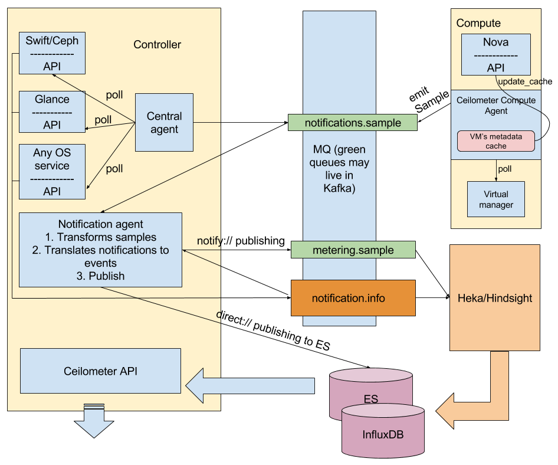

.. _architecture:

Architecture overview
---------------------

The following diagram shows the OpenStack Telemetry Plugin architecture:

Ceilometer agents are deployed as follows:

* Central agents service is placed on controllers. This service polls metrics
  about OpenStack services. A central agent obtains the measurements and sends
  them to the ``notifications.sample`` queue.

  .. note:: If Kafka is not deployed, only one central agent will be running
            in the environment under Pacemaker. If Kafka is deployed, the
            coordination mechanism with Zookeeper will be automatically
            enabled. For more information about coordination, see
            <TODO: add a link to Ceilometer docs>.

* Compute agents work on compute nodes. The main difference from central
  agents is that compute agents use metadata cache. The Telemetry plugin
  enables this feature. The compute agents request instance metadata from Nova
  API every 10 minutes, but not each polling interval. For more information,
  see the official Telemetry docs <TODO: add a link>. A compute agent obtains
  the measurements and sends them to the ``notifications.sample`` queue.

* Notification agents are placed on controllers. Each notification agent
  performs the following:

  * Obtains data from polling agents and OpenStack services. In other words,
    it listens to the ``notifications.sample`` and ``notifications.info``
    queues.
  * Performs some transformations and sends the data further. The Telemetry
    plugin may be customized at this point. By default, Ceilometer
    notification agents do not convert OpenStack notifications to Ceilometer
    Events. If you enable this functionality <TODO add link to installation>,
    notification agents will write Events directly to Elasticsearch with the
    ``direct://`` publisher. In any case, notification agents send
    measurements to the ``metering.sample`` queue.

    .. note::
       In Mirantis OpenStack, Ceilometer notification agents do not require
       coordination. For more details, see <TODO: add he link to transformers
       stuff for Ceilometer in MOS 9.0>

A Notification agent is the last Ceilometer-related processor. As a result,
all the data collected is placed in the ``metering.sample`` queue and
Ceilometer Events are written into Elasticsearch (if Event API is enabled).
Ceilometer agents do not depend on the message queue we use because they work
with the message queue through ``oslo.messaging``.

To continue data processing, Hindsight or Heka are used. The diagram above
shows Heka/Hindsight separately because their placement depends on what is
actually chosen. For information about Heka, see <TODO: add links>.
For a proper work with Kafka, we use a new generation of Heka called Hindsight.
<TODO: add a link here>. Hindsight supports all the required Kafka
functionality but cannot be used to work with RabbitMQ. Therefore, these
instruments are used depending on the message queue:

* If Kafka is deployed, Hindsight is deployed on the same nodes where Kafka is
  running. Hindsight is started with 4 input plugins to make data consumption
  fast enough. Hindsight services are not running under Pacemaker, but the
  service will be restarted automatically in case of any failures. Heka will
  not be started.

* If Kafka is not deployed, RabbitMQ will be used as a transport system. To
  deal with this case, Heka will be running on each controller under
  Pacemaker. Hindsight will not be running.

Once Heka or Hindsight receives a data sample, it is processed through a chain
of plugins and finally sent to InfluxDB or Elasticsearch.